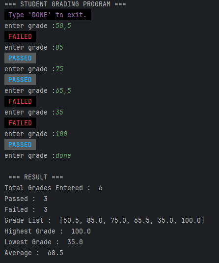

# 📊 CLI Simple Student Grading

A simple, interactive student grade management tool built with Python. This project demonstrates core programming concepts, including data structures, input validation, and statistical calculations with real-time feedback.

---

## 📌 Features

- **Dynamic Data Entry:** Enter as many grades as needed until you type 'DONE'.
- **Flexible Decimals:** Handles both dot (`.`) and comma (`,`) as decimal separators for better user experience.
- **Real-time Status:** Instantly displays "PASSED" or "FAILED" status for each entry using ANSI color codes.
- **Statistical Summary:** Provides a complete report including total entries, highest/lowest scores, and average calculation.
- **Error Handling:** Robust validation to prevent crashes from invalid text or out-of-range numbers (0-100).

---

## 🛠️ Teknology Stack 

- **Language:** Python 3.14
- **Interface:** Command Line Interface (CLI)
- **Concepts:** Loops (`while`), Conditionals (`if-else`), Exception Handling (`try-except`), and List Manipulation.
- **Styling:** ANSI color codes for stylized terminal output

---

## ▶️ How to Run

1. Ensure Python is installed on your system

2. Clone repository:

   ```bash
   git clone https://github.com/CountryIna/simple_student_grading.git
   ```

3. Navigate to the project folder:

   ```bash
   cd simple_student_grading
   ```

4. Run the program:

   ```bash
   python simple_student_grading.py
   ```

---

## 💻 Output Example

 Here is an example of the program output when run in the terminal:



---

## 📚 Project Objectives

This program was developed to:
* Practice fundamental Python programming and logic flow.
* Implement robust input validation and data cleaning (handling `,` vs `.`)
* Utilize built-in Python functions like `max()`, `min()`, `sum()`, and `len()`.
* Manage data collections using Python `Lists`.

---

## 🚀 Future Improvements

Upcoming enhancements for this project:
* **Data Persistence**: Saving the final result report to a .txt or .csv file.
* Implementing a Graphical User Interface (GUI) using Tkinter or PyQt
* **Multi-Subject**: Adding functionality to input student names and multiple subjects.

---

## 🤝 Contribution

Contributions are welcome! Feel free to fork this repository and enhance it as needed.

---

## 👨‍💻 Author

Created by **[Country Ina]**

---
